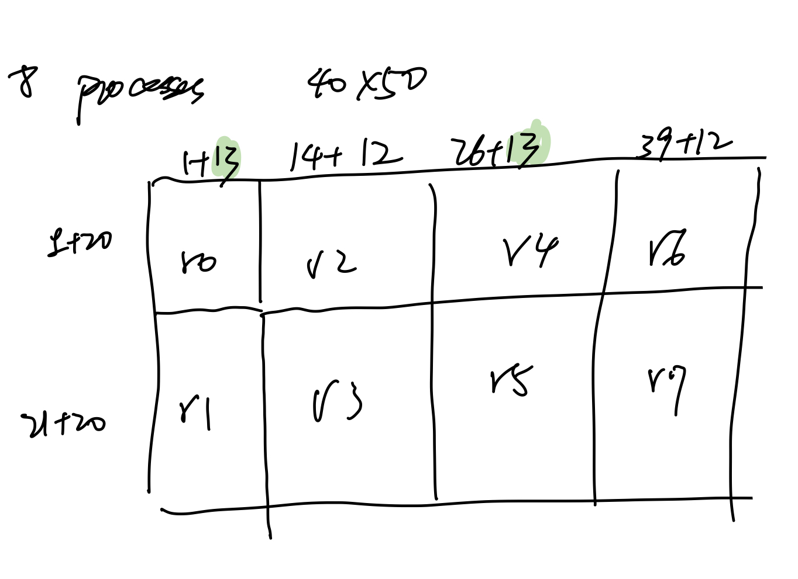
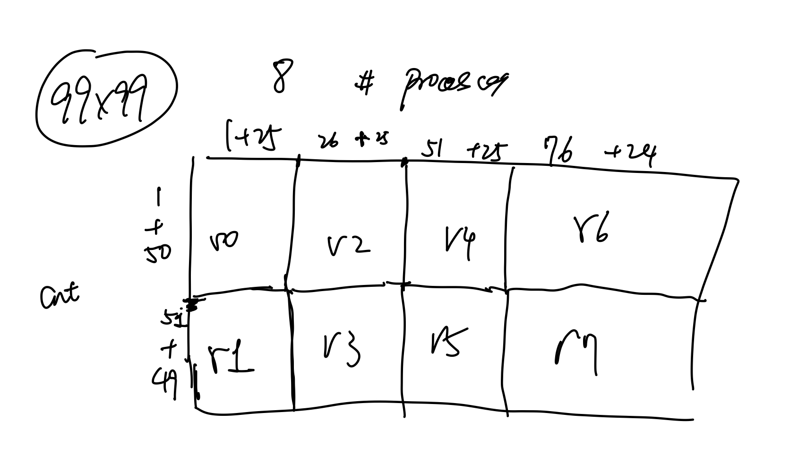
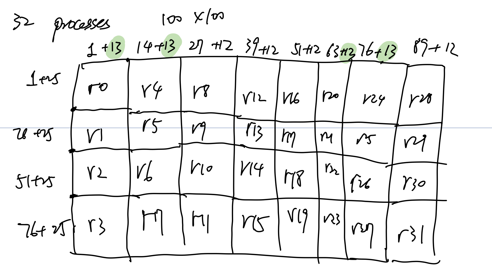

1. Doing experiments to checked how data is partitioned among ranks.

    MPI ranks are first arranged in colmns and then in rows. All 3 figures below show the cases when num_elements can not be devided up by num_processes. For example, in the case 100x100 with 32 processes, `+13`s are not at the heading columns.

    
    
    
	
2. Tested the nonblocking_write.c example of PnetCDF and analysed how WRF implements writes. For example for the case of 99x99 grids using 8 mpi processes, each mpi process will call `NFMPI_PUT_VARA_\<type>_all` 177 times to write a file, one for each variable. 

    There are 7 layers of functions, where the layer 7 function (`output_wrf`) calls layer 6 function (`wrf_ext_write_field`) 177 times, then layer 6 function layer 5,....till the layer 1 function (`ext_pnc_RealFieldIO`) is called. The layer 1 function is the function that calls `NFMPI_PUT_VARA_\<type>_all`. The local write buffer is allocated in Layer 3 function (`ext_pnc_write_field`).

    I looked at these functions to see where I can make modifications to support non-blocking writes. My plan is to figure out the buffer size and attach it in `output_wrf` function (layer 7), call `bput` in `ext_pnc_RealFieldIO` (layer 1). And then call `ncmpi_wait_all` and `ncmpi_buffer_detach` in `output_wrf` (layer 7).

    The current problem is to figure out and implement the buffer size. It is needed in layer 7 before the 177 calls (loops) begin, but is calculated inside each one of the 177 calls in layer 3.

3. Kaiyuan provided the compatibility of LOG Vol at this [link](https://github.com/DataLib-ECP/vol-log-based/blob/master/doc/compatibility.md). I also compiled and ran the [vol-tests](https://github.com/HDFGroup/vol-tests/tree/b42872413933ae7a90035731330f98d9939a9f22) provided by HDFGroup. I am trying to understand its feedback, including which messages are expected and which are not. For example, I am not sure if messages complaining about "Virtual File Layer not MPI-IO" is expected.

Other uodate: I just arrived in Japan hours ago and I am not in US for a week.
